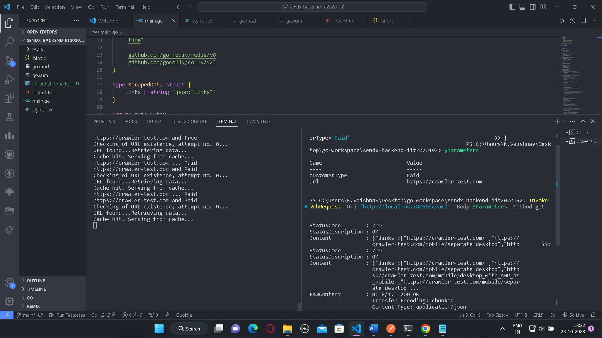

# sendx-backend-iit2020192
Welcome to my Go web application README! This document will provide you with essential information about the project, its features, how to set it up, and how to use it.
I have implemented 2 parts of the assignment:
<ul>
  <li>Required</li>
  <li>Good to have</li>
</ul>

## Tech used:

<ul>
	<li>Go</li>
	<li>HTML</li>
	<li>CSS</li>
	<li>Redis</li>
	<li>Postman (for testing)</li>
</ul>

## Features used:

<ul>
	<li>Checks the existance of webURL giving by the user (based on status code returned). If also retires to check 3 time (can be changes according to user's choice)</li>
	<li>It maintains 2 queues = PaidCustomers, FreeCustomers. I have assigned 5 crawler workers for PaidCustomers and 2 crawler workers for FreeCustomers. The crawler workers can crawl multiple pages concurrently.</li>
	<li>Before Processing a request, we first chweck if the data is present in cache or not. If present, we simple fetch data from cache and return. This significantly improves application performance and response time.</li>
	<li>This application crawls the webpage using gocolly, at the rate depth=2. It maintains a visited array to store those urls which are already visited (to reduce redundance of the application to crawl same weblinks again and again)</li>
	<li>I have commented out</li>

	// c.Limit(&colly.LimitRule{DomainGlob: "*", Parallelism: 2})
This can also improve perfomance significantly by restricting ourselves to same domain and parellel crawlling.
</ul>

## Steps for Installation:
<ul>
	<li>Start by cloning the repo:</li>
	
	git clone https://github.com/vaishnav-192/sendx-backend-iit2020192
	cd sendx-backend-iit2020192

<li>Get required Dependencies:</li>

	go get github.com/go-redis/redis/v8
 	github.com/gocolly/colly/v2

 <li>Run Redis-server from ~/Redis/redis-server. Do not close the Redis-server, keep it running in background</li>
 <li>Run main.go</li>

 	go  run main.go

<li>open chrome (or any other web browser). Enter URL: http://localhost:8080</li>

	http://localhost:8080

<li>Enter your desired website to start crawling and clink on submit button.</li>

<li>We can see application will start crawling on the webpage</li>

<li>After crawling is finished, user will get an output JSON file, containing all the links application crawled so far (until depth=2, can be changed according to user needs in code)</li>

<li>After Crawling we cache the data fetched in Redis with 1hr TTL(time to live), as show in the following image</li>

<li>Whenever that website is called again to crawl(within a time gap of 1hr), we return the data from cache. Website is not crawled, as shown below:</li>

<li>We can use Postman application also. Setup for Postman application:</li>

<li>We can use API calls from postman to run the application</li>

<li>Pay attention to the time taken to fetch data for a website for first time (image is attached below). There will be cache miss. As a result, the time taken to fetch the data is huge.</li>

<li>If user calls the same website again within 1hr of last time call, we can see this time cache was hit!!  Pay attention to the time taken to fetch the data. It is significantly faster than before!!</li>

<li>We can also give inputs using curl (or Invoke-WebRequest) by following steps:</li>

<ul>
	<li>create a JSON type variable using '$' sign example : </li>

 		$parameter = @{
	 	url = 'https://example.com'
		customerType = 'Paid'
		}

if 'customerType' field is not given, bu default it takes 'Free' customer.

<li>Use the following command to invoke the web application as shown in image</li>

</ul>
 
</ul>

### Major takeawys from this project:
<ul>
	<li>Understanding working/exploring Golang --Added Experience</li>
	<li>Hands on experience of building a scalable application</li>
	<li>error handeling</li>
</ul>

<table>
  <tr>
    <td align="center"><a href="https://github.com/vaishnav-192"> <b>Vaishnav Kamarti</b></a> IIT2020192</td>
 </tr>
</table>

